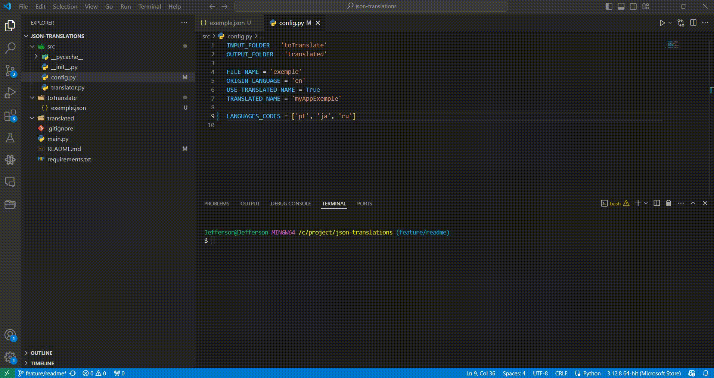

# Translation Project

## Description
This project translates an English JSON file into multiple languages using the Google Translate API.

## Folder Structure
- `toTranslate/`: Contains the source JSON file (`exemple.json`).
- `translated/`: Contains the translated JSON files.
- `src/`: Contains the Python scripts for translation logic.
- `main.py`: Main script that triggers the translation process.

## Setup
1. Install the required Python dependencies:
   ```bash
   pip install -r requirements.txt

## src/config.py
### Configurations
1. `INPUT_FOLDER`: It's the folder's name to be created that will contain the file that you want to translate. 
2. `OUTPUT_FOLDER`: It's the folder's name to be created that all the translations will be saved after the success.
3. `FILE_NAME`: It's yours file's name (not necessary to use the extension, like 'app.json', only 'app').
4. `ORIGIN_LANGUAGE`: It's the original language that the app will read to tanslate for another's language.
5. `USE_TRANSLATED_NAME`: A boolean variable to change the translations saved name more suitble for you.
6. `TRANSLATED_NAME`: If `USE_TRANSLATED_NAME` is True, the translations saved name will use the provided name \
to create the file's name, if the provided name is `app`, the file name will be saved as `app-it.json` \
otherwise will be saved as `it.json`
7. `LANGUAGES_CODES`: it's an array of languages. Example: ['pt', 'es', 'it', 'fr']. \ It will translate for the languages you pass in this array.

## Run App
3. To run this app:
   ```bash
   python main.py

## Screenshots

