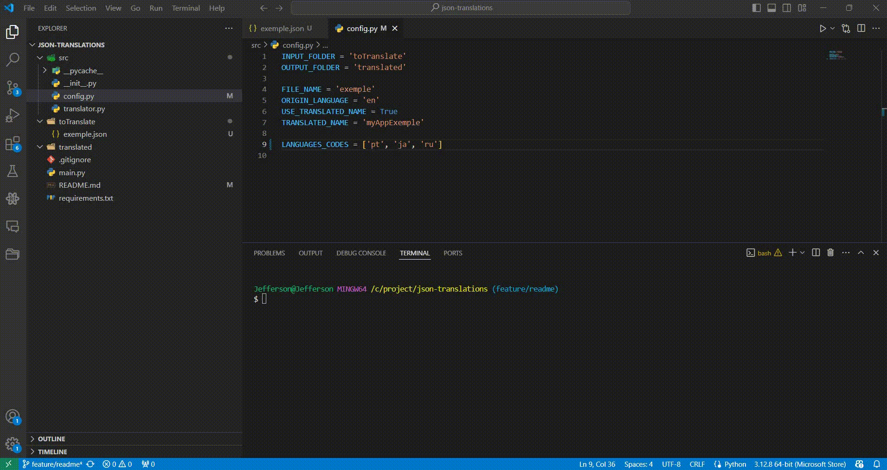

# Translation Project

## Description
This project translates an English JSON file into multiple languages using the Google Translate API.

## Folder Structure
- `toTranslate/`: Contains the source JSON file (`exemple.json`).
- `translated/`: Contains the translated JSON files.
- `src/`: Contains the Python scripts for translation logic.
- `main.py`: Main script that triggers the translation process.

## Setup
1. Install the required Python dependencies:
   ```bash
   pip install -r requirements.txt

## src/config.py
### Configurations
1. `INPUT_FOLDER`: It's the folder's name to be created that will contain the file that you want to translate. 
2. `OUTPUT_FOLDER`: It's the folder's name to be created that all the translations will be saved after the success.
3. `FILE_NAME`: It's yours file's name (not necessary to use the extension, like 'app.json', only 'app').
4. `ORIGIN_LANGUAGE`: It's the original language that the app will read to tanslate for another's language.
5. `USE_TRANSLATED_NAME`: A boolean variable to change the translations saved name more suitble for you.
6. `TRANSLATED_NAME`: If `USE_TRANSLATED_NAME` is True, the translations saved name will use the provided name \
to create the file's name, if the provided name is `app`, the file name will be saved as `app-it.json` \
otherwise will be saved as `it.json`
7. `LANGUAGES_CODES`: it's an array of languages. Example: ['pt', 'es', 'it', 'fr']. \ It will translate for the languages you pass in this array.

## Run App
3. To run this app:
   ```bash
   python main.py

## Screenshots



## Supported Languages
- Below is the full list of languages supported by the translation engine used in this project. To translate into any of these, just include the corresponding language code in your LANGUAGES_CODES list in src/config.py.

| Language             | Code       | Language                 | Code    | Language                | Code  |
| -------------------- | ---------- | ------------------------ | ------- | ----------------------- | ----- |
| Afrikaans            | `af`       | Albanian                 | `sq`    | Amharic                 | `am`  |
| Arabic               | `ar`       | Armenian                 | `hy`    | Assamese                | `as`  |
| Aymara               | `ay`       | Azerbaijani              | `az`    | Bambara                 | `bm`  |
| Basque               | `eu`       | Belarusian               | `be`    | Bengali                 | `bn`  |
| Bhojpuri             | `bho`      | Bosnian                  | `bs`    | Bulgarian               | `bg`  |
| Catalan              | `ca`       | Cebuano                  | `ceb`   | Chichewa                | `ny`  |
| Chinese (Simplified) | `zh-CN`    | Chinese (Traditional)    | `zh-TW` | Corsican                | `co`  |
| Croatian             | `hr`       | Czech                    | `cs`    | Danish                  | `da`  |
| Dhivehi              | `dv`       | Dogri                    | `doi`   | Dutch                   | `nl`  |
| English              | `en`       | Esperanto                | `eo`    | Estonian                | `et`  |
| Ewe                  | `ee`       | Filipino                 | `fil`   | Finnish                 | `fi`  |
| French               | `fr`       | Frisian                  | `fy`    | Galician                | `gl`  |
| Georgian             | `ka`       | German                   | `de`    | Greek                   | `el`  |
| Guarani              | `gn`       | Gujarati                 | `gu`    | Haitian Creole          | `ht`  |
| Hausa                | `ha`       | Hawaiian                 | `haw`   | Hebrew                  | `he`  |
| Hindi                | `hi`       | Hmong                    | `hmn`   | Hungarian               | `hu`  |
| Icelandic            | `is`       | Igbo                     | `ig`    | Ilocano                 | `ilo` |
| Indonesian           | `id`       | Irish                    | `ga`    | Italian                 | `it`  |
| Japanese             | `ja`       | Javanese                 | `jv`    | Kannada                 | `kn`  |
| Kazakh               | `kk`       | Khmer                    | `km`    | Kinyarwanda             | `rw`  |
| Konkani              | `gom`      | Korean                   | `ko`    | Krio                    | `kri` |
| Kurdish (Kurmanji)   | `ku`       | Kurdish (Sorani)         | `ckb`   | Kyrgyz                  | `ky`  |
| Lao                  | `lo`       | Latin                    | `la`    | Latvian                 | `lv`  |
| Lingala              | `ln`       | Lithuanian               | `lt`    | Luganda                 | `lg`  |
| Luxembourgish        | `lb`       | Macedonian               | `mk`    | Maithili                | `mai` |
| Malagasy             | `mg`       | Malay                    | `ms`    | Malayalam               | `ml`  |
| Maltese              | `mt`       | Maori                    | `mi`    | Marathi                 | `mr`  |
| Meiteilon (Manipuri) | `mni-Mtei` | Mizo                     | `lus`   | Mongolian               | `mn`  |
| Myanmar (Burmese)    | `my`       | Nepali                   | `ne`    | Norwegian               | `no`  |
| Nyanja (Chichewa)    | `ny`       | Odia (Oriya)             | `or`    | Oromo                   | `om`  |
| Pashto               | `ps`       | Persian                  | `fa`    | Polish                  | `pl`  |
| Portuguese           | `pt`       | Punjabi                  | `pa`    | Quechua                 | `qu`  |
| Romanian             | `ro`       | Russian                  | `ru`    | Samoan                  | `sm`  |
| Sanskrit             | `sa`       | Scots Gaelic             | `gd`    | Sepedi (Northern Sotho) | `nso` |
| Serbian              | `sr`       | Sesotho (Southern Sotho) | `st`    | Shona                   | `sn`  |
| Sindhi               | `sd`       | Sinhala                  | `si`    | Slovak                  | `sk`  |
| Slovenian            | `sl`       | Somali                   | `so`    | Spanish                 | `es`  |
| Sundanese            | `su`       | Swahili                  | `sw`    | Swedish                 | `sv`  |
| Tajik                | `tg`       | Tamil                    | `ta`    | Tatar                   | `tt`  |
| Telugu               | `te`       | Thai                     | `th`    | Tigrinya                | `ti`  |
| Tsonga               | `ts`       | Turkish                  | `tr`    | Turkmen                 | `tk`  |
| Twi                  | `ak`       | Ukrainian                | `uk`    | Urdu                    | `ur`  |
| Uyghur               | `ug`       | Uzbek                    | `uz`    | Vietnamese              | `vi`  |
| Welsh                | `cy`       | Xhosa                    | `xh`    | Yiddish                 | `yi`  |
| Yoruba               | `yo`       | Zulu                     | `zu`    |                         |       |
